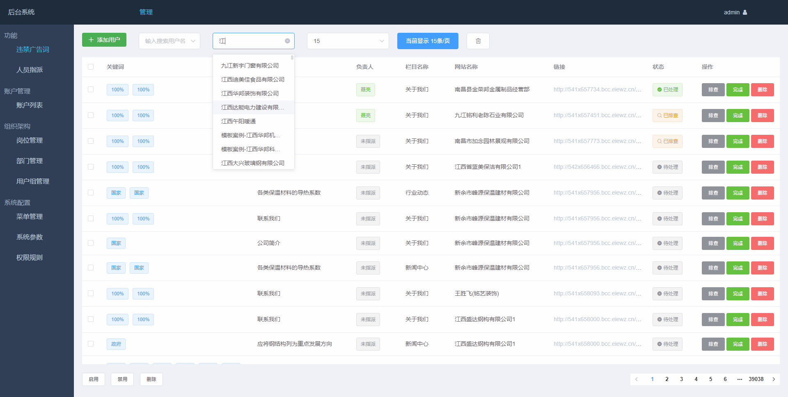

# Vue+Thinkphp5.1开发的后台管理系统
### 项目原型为[vuethink](https://github.com/honraytech/VueThink)
这里将项目重构升级到了各模块最新版本，修复了原有的bug，并基于此架构添加了新功能   
后端将核心框架升级至5.1，并将所有代码适配兼容了5.1的规范  
前端由webpack1升级至webpack4，更新elementui至2.x版本，可参考 **[/s1973/sss_panel/frontEnd/UPDATE.md](https://github.com/s1973/sss_panel/blob/master/frontEnd/UPDATE.md)**  
更新部分vue用法  
此项目自我学习之用，同时探索B/S架构对实际生产效率的提升，也将不断验证自己的想法并增加新功能，水平有限，希望能多加交流指点^_^
### 新增广告词管理功能
后端数据为使用Python多进程+协程爬取的网站平台6000多站点的违规词信息  
实现了数据管理、筛选，人员指派，状态管理，账号权限控制等

### 主要技术栈
- 后端框架：ThinkPHP 5.1.x
- 前端MVVM框架：Vue.JS 2.5
- 开发工作流：Webpack 4.x
- 路由：Vue-Router 3.0.2
- 数据交互：Axios
- 代码风格检测：Eslint
- UI框架：Element-UI 2.4.11
- JS函数库：Lodash
### 数据交互
数据交互通过axios以及RESTful架构来实现  
用户校验通过登录返回的auth_key放在header